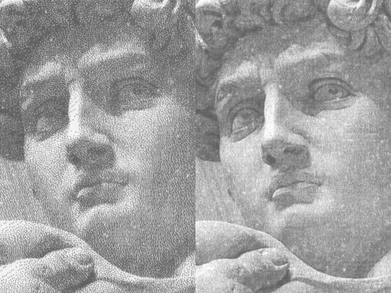

# Multi-tone prints on Epson thermal receipt printers

Thermal receipt printers can usually only output black or white, dot or no dot, but certain Epson models support "multi-tone" printing, which means that we can specify up to 16 levels of gray for each pixel/dot.

Having 16 levels (in theory, more like 8 levels in practice, more on this later) instead of just 2 makes a **drastic** difference when printing multi-tone logotypes and images in particular on these little printers.

This is achieved by using the [GS 8 L](https://download4.epson.biz/sec_pubs/pos/reference_en/escpos/gs_lparen_cl.html)-command ([function 112](https://download4.epson.biz/sec_pubs/pos/reference_en/escpos/gs_lparen_cl_fn112.html)) to define 4-bit image data in a [planar](https://en.wikipedia.org/wiki/Planar_%28computer_graphics%29) fashion.


To illustrate the difference between 1-bit and 4-bit images, here's an image of Michelangelo's David, represented on the left in **2 colors**, and on the right in **8 colors**, both images with sharpening and [error diffusion](https://en.wikipedia.org/wiki/Error_diffusion) dithering applied, without sRGB/gamma linearization.


Quite a difference huh? But why only 8 levels when there's 4 bitplanes and hence 16 levels available in software? Well, it turns out that when you try to print all levels from 16 (pure black) to 0 (pure white), we only get about 8 discernable levels on paper. Here's an example:


It might be hard to pick up from the image, but the first 3 steps are essentially the same, followed by 2 steps of a slightly lighter shade, followed by yet another 2 steps of a slightly lighter shade, and from there on we get 4 levels of gray before we hit pure white. 8 levels in total.

It seems to me like the heat applied by the thermal head isn't enough to make a difference at the lower levels, while the thermal coating on the paper gets fully saturated at the higher levels. A lack of dynamic range of sorts?

To work around this limitation in hardware we have to use [dithering](https://en.wikipedia.org/wiki/Dither#Applications) to make our 8 discernable levels appear like 16 different levels to the human eye (which acts sort-of like a low-pass filter). Here's an example of the same gradient ramp, now with error diffusion dithering applied:


It should be noted that you can adjust the "print density" for both monochrome prints as well as multi-tone prints by using the [GS ( E <Function 5>), a=5 and a=117](https://download4.epson.biz/sec_pubs/pos/reference_en/escpos/gs_lparen_ce_fn05.html) commands, which affects the amount of energy that the thermal head applies to the paper. But I have not been able to reproduce any more than 8 levels no matter what values I set these density settings to. Different papers do require higher or lower density settings, to prevent the prints from looking oversaturated or washed out.

# Bi-level vs multi-tone example prints

Here's an example of a bilevel (1-bit) print to the left, and a multi-tone (4-bit) print to the right.



# Disadvantages of multi-tone prints

Lighter shades of gray will fade more quickly than darker shades, due to the nature of thermal paper, so bi-level printing is preferable if long-term legibility is of concern.

You can greatly improve the logevity of your prints by using a high quality thermal paper, increasing the print density and by storing it properly.

See [Guide to thermal paper](https://www.anixter.com/content/dam/Suppliers/Brother/White%20Papers/ThermalPaperWhitePaper%20(WP1).pdf) for more information.

# Epson printers with 4-bit multi-tone support

These are the printers that seem to support 4-bit graphics via the **GS 8 L**-command, please send me a pull request if I have missed any:

- TM-T70II
- TM-T88V
- TM-T88VI
- TM-T88VII

# Installation / usage instructions

```
    poetry shell
    poetry install

    epson --output-image preview.png --output-file output.bin <INPUT_IMAGE>
    nc <PRINTER_IP> 9100 < output.bin
```

See `epson --help` for a full list of available parameters.

# Usage with other libraries and/or languages

The output-file contains raw ESCPOS-commands which can be sent to your printer from any library or language, as long as there's a method that let you pass raw data to the printer.

## escpos-php example

```php
<?php
require __DIR__ . '/vendor/autoload.php';
use Mike42\Escpos\PrintConnectors\NetworkPrintConnector;
use Mike42\Escpos\Printer;

$connector = new NetworkPrintConnector("printer.example.com", 9100);
$printer = new Printer($connector);

try {
        $multitone_image = file_get_contents("multitone-image.bin");
        $printer->getPrintConnector()->write($multitone_image);
        $printer->cut();

} finally {
        $printer -> close();
}
?>
```


## python-escpos

```python
from escpos import printer

p = printer.Serial()

with open("multitone-image.bin", "rb") as file:
    data = file.read()

p._raw(data)
p.cut()
```