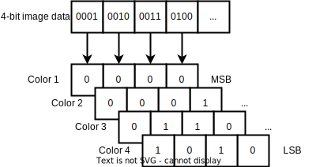
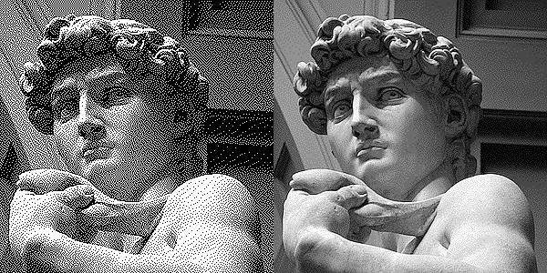
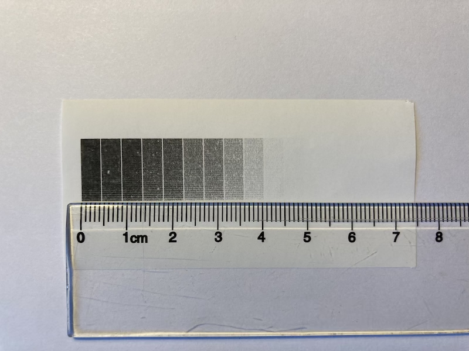
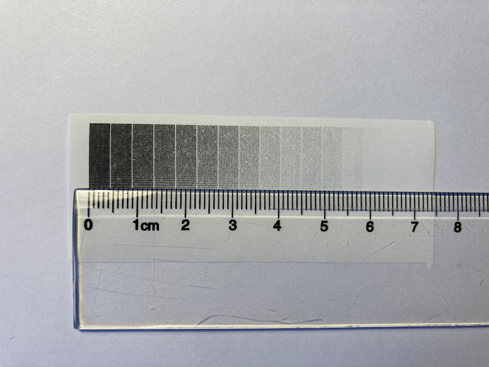
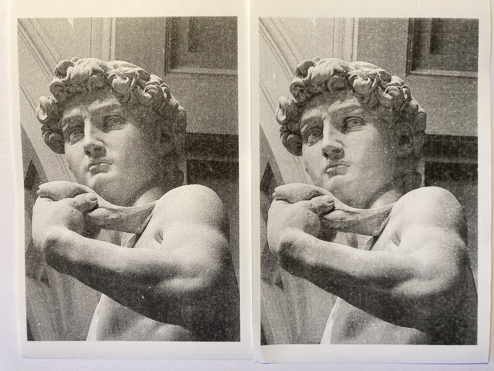

# Multi-tone prints on Epson thermal receipt printers

Some of the Epson thermal receipt printers support "multi-tone" printing, which means that you can specify 16 levels of gray for each pixel/dot.

This is achieved by using the [GS 8 L](https://download4.epson.biz/sec_pubs/pos/reference_en/escpos/gs_lparen_cl.html)-command ([function 112](https://download4.epson.biz/sec_pubs/pos/reference_en/escpos/gs_lparen_cl_fn112.html)) to specify 4-bit image data in a [planar](https://en.wikipedia.org/wiki/Planar_%28computer_graphics%29) fashion.

Having 16 levels (in theory) instead of just 2 (black & white) makes a huge difference when printing images and multi-tone logotypes on these printers.

To illustrate the difference, here's an image of Michelangelo's David, represented on the left in **2 colors**, and on the right in **8 colors**, both images with sharpening and [error diffusion](https://en.wikipedia.org/wiki/Error_diffusion) dithering applied, without sRGB/gamma linearization.

## Wait, 8 colors? I thought you said 16?

Epson gives us 4 bitplanes, so in theory we should be able to specify 16 levels for each pixel/dot, but in practice we only get ~8 levels, since the printer cannot accurately reproduce 16 levels once we print them out on paper.

This is clearly visible if we print a gradient ramp of all the colors from black (16) to pure white (0);

It might be hard to pick up from the image, but the first 3 steps are essentially the same, followed by 2 steps of a slightly lighter shade, followed by yet another 2 steps of a slightly lighter shade, and from there on we get 4 levels of gray before we hit pure white. So 8 levels in total.

It is possible to adjust the "print density" for both monochrome and multi-tone prints via the [GS ( E <Function 5>), a=5 and a=117](https://download4.epson.biz/sec_pubs/pos/reference_en/escpos/gs_lparen_ce_fn05.html) commands, but I was never able to bring out any more distinct levels than 8 in total. **You will have to tweak your density setting depending on which paper you use, I find that using thicker paper requires a higher density setting.**

We can of course fake 16 levels by utilising some sort of dithering, to make our 8 levels appear as 16 levels or more. As such;

# Bi-level vs multi-tone example print

Here's an example of a bilevel print to the left, and a multi-tone print to the right. **Make sure to click the image to view it in a separate tab to fully appreciate the difference.**

# Disadvantages of multi-tone prints

Lighter shades of gray will fade more quickly than darker shades, due to the nature of thermal paper, so bi-level printing is preferable if long-term legibility is of concern.

You can greatly improve the logevity of your prints by using a high quality thermal paper.

See [Guide to thermal paper](https://www.anixter.com/content/dam/Suppliers/Brother/White%20Papers/ThermalPaperWhitePaper%20(WP1).pdf) for more information.

# Epson printers with 4-bit multi-tone support

- TM-T70II
- TM-T88V
- TM-T88VI
- TM-T88VII
