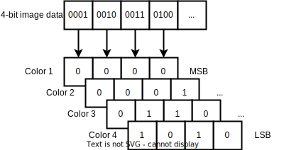

# Multi-tone prints on Epson thermal receipt printers

Some of the Epson thermal receipt printers support "multi-tone" printing, which means that you can specify up to 16 levels (theoretically, more like 8 levels realistically) of gray for each dot.

This is achieved by using the [GS 8 L](https://download4.epson.biz/sec_pubs/pos/reference_en/escpos/gs_lparen_cl.html)-command ([function 112](https://download4.epson.biz/sec_pubs/pos/reference_en/escpos/gs_lparen_cl_fn112.html)) to specify 4-bit raster data in a [planar](https://en.wikipedia.org/wiki/Planar_%28computer_graphics%29) fashion.

## Disadvantages of multi-tone prints

Lighter shades of gray will fade more quickly than darker shades, due to the nature of thermal paper, so bi-level printing is preferable if long-term legibility is of concern.

## Models with 4-bit multi-tone support

- TM-T70II
- TM-T88V
- TM-T88VI
- TM-T88VII
